[](https://github.com/k2works/application_programing_excercise_2022/actions/workflows/node.js.yml)

# アプリケーション開発のための練習プログラミング

## 概要

Spring 徹底入門 Spring Framework による Java アプリケーション開発 チュートリアルの実装例

### 目的

- SpringBootの学習
- 戦略・戦術的DDD 及び [CCSR手法](https://masuda220.hatenablog.com/entry/2020/05/27/103750) の実践
- テスト駆動開発とリファクタリングの実践
- 継続的インテグレーションの実践

### 前提

| ソフトウェア | バージョン  | 備考 |
|:-------|:-------| :--- |
| nodejs | 16.3.0 |      |
| java   | 17.0.0 |      |

#### Quick Start

```bash
docker-compose up -d 

npm install

npm start
```

### 事例 ドメイン: S社

S社は、地方都市に本社を置くビル管理サービス事業会社である。市内に複数のビルを所有しており、主な事業は不動産賃貸業務及び設備総合管理業務である。

近年、所有物件の稼働率を向上するべく貸会議室運営業務に新たに取り組んでいるが状況は芳しくない。

現在、貸会議室運営業の大半は手作業で行われている。最近、サービスを紹介するWebページと会議室予約システムの初回リリースが行われたが担当者の急な退職により十分な引継ぎが行われなかったため仕様を把握する人間が不在の状況となっている。

利用可能な会議室の登録は手作業でシステムに登録しているため、登録漏れや登録間違いにより予約した会議室が使えない、利用したい会議室がいつも使えないなど利用者からのクレームが発生しておりサービス品質向上が求めらている。
また、プロジェクタやホワイトボードなど付随する設備の要望が上がっているが十分に対応できていない状況である。

S社としては、効率化によるサービス品質向上と会員管理の強化によるサブスクリプションサービスで収益を多様化することで貸会議室運営業務を新たな収益の柱に成長させたいと考えている。

- [参照1](https://www.saycogroup.co.jp/company/about/)
- [参照2](https://www.ekimaekaigi.com/)

## 実践

要件・開発に [CCSR手法](https://masuda220.hatenablog.com/entry/2020/05/27/103750) を適用



### [要件](./docs/index.adoc)

### [開発](./docs/index.adoc)

### [運用](./docs/index.adoc)
