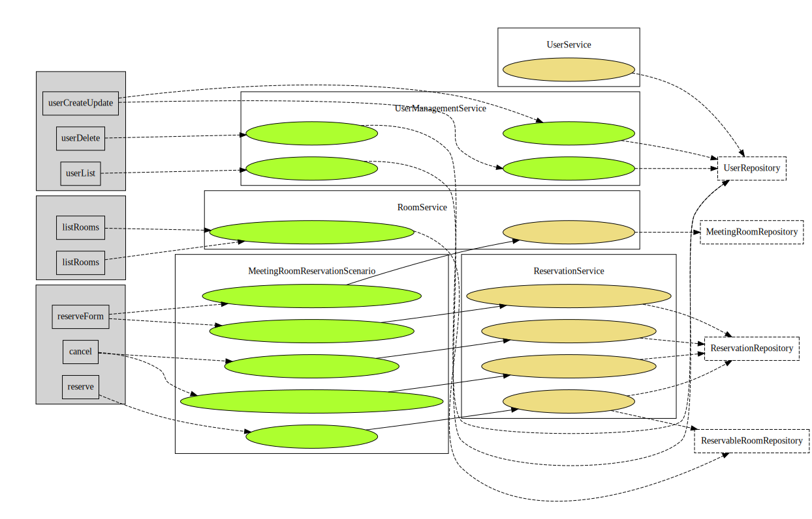
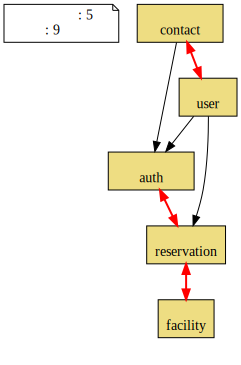
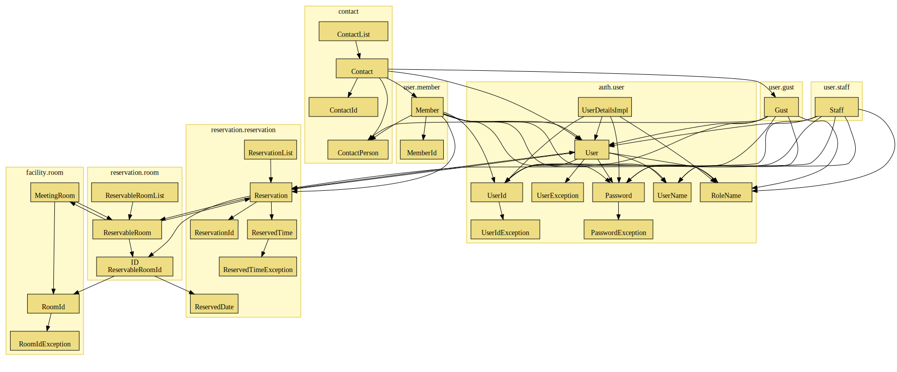
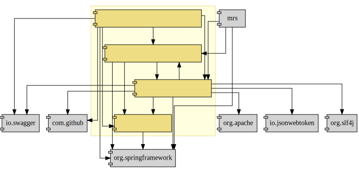
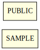
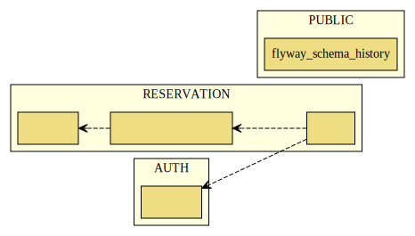
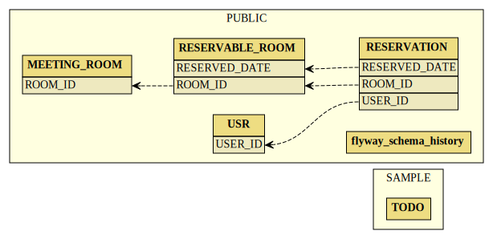

:toc: left
:toclevels: 5
:sectnums:
:stem:
:source-highlighter: coderay

= MeetingRoomReservationSystem

== 要求

=== 概要

要求定義にはリレーションシップ駆動要件分析(RDRA)を使用する。

RDRAとは短時間で要件を把握することを目的とした軽量の手法。 RDRAでは、決められたアイコンを使い、アイコンとアイコン、アイコンと図を関連づけ、アイコンで表現されたモデル要素と関連のつながりから要件を説明する。

____
image::images/rdra.png[]
image::images/rdra2.png[]
____

https://www.amazon.co.jp/RDRA2-0-%E3%83%8F%E3%83%B3%E3%83%89%E3%83%96%E3%83%83%E3%82%AF-%E8%BB%BD%E3%81%8F%E6%9F%94%E8%BB%9F%E3%81%A7%E7%B2%BE%E5%BA%A6%E3%81%AE%E9%AB%98%E3%81%84%E8%A6%81%E4%BB%B6%E5%AE%9A%E7%BE%A9%E3%81%AE%E3%83%A2%E3%83%87%E3%83%AA%E3%83%B3%E3%82%B0%E6%89%8B%E6%B3%95-%E7%A5%9E%E5%B4%8E%E5%96%84%E5%8F%B8-ebook/dp/B07STQZFBX[RDRA2.0 ハンドブックより引用]

=== システム価値

==== システムコンテキスト

[plantuml]
----
@startuml

title システムコンテキスト図

left to right direction

actor 会員
actor 図書館員

agent 書籍通販会社

usecase 図書館システム
note top of 図書館システム
  図書館員の作業 (書籍購買の自動連携) を支援し、本の貸
  出・返却業務において会員を待たせないスムーズな運用を
  実現する。蔵書管理をリアルタイムで行い、検索、在庫な
  ど会員サービスを向上させる
end note

:会員: -- (図書館システム)
:図書館員: -- (図書館システム)
(図書館システム) -- 書籍通販会社

@enduml
----

==== 要求モデル

[plantuml]
----
@startuml

title 要求モデル図

left to right direction

actor 司書
note "本の購入を簡素化したい" as s_r1
note "返却率が悪くならないように返却を簡単にする" as s_r2
note as s_dr1 #Turquoise
  本の購入を Web で直接行え、購入した本の情
  報をそのままシステムに取り込めること
end note
:司書: -- s_r1
:司書: -- s_r2
s_r1 -- s_dr1
s_r2 -- s_dr1

actor 図書館員
note "本の貸出、返却手続きを簡素化したい" as t_r1
note "本の在庫をリアルタイムで把握したい" as t_r2
note as t_dr1 #Turquoise
  本の貸出と返却を簡易に行え、リアルタ
  イムで在庫に反映できること
end note
:図書館員: -- t_r1
:図書館員: -- t_r2
t_r1 -- t_dr1
t_r2 -- t_dr1

actor 会員
note "見たい本が図書館にあるかを Web で検索したい" as k_r1
note "借りたい本を Web で予約したい" as k_r2
note as k_dr1 #Turquoise
  Web で借りたい本を検索でき、
  そのまま予約できること
end note
:会員: -- k_r1
:会員: -- k_r2
k_r1 -- k_dr1
k_r2 -- k_dr1

@enduml

----

=== システム外部環境

==== ビジネスコンテキスト

[plantuml]
----
@startuml

title ビジネスコンテキスト図

left to right direction

actor 会員

node 図書館 {
  rectangle 窓口 {
    actor 図書館員
  }
  rectangle 司書室 {
    actor 司書
  }
  usecase 会員管理
  usecase 貸出返却
  usecase 蔵書管理
  artifact 蔵書
  artifact 書架
}

node 書籍店

:会員: -- (会員管理)
(会員管理) -- :図書館員:

:会員: -- (貸出返却)
(貸出返却) -- :図書館員:
(貸出返却) -- 蔵書
(貸出返却) -- 書架

蔵書 -- (蔵書管理)
書架 -- (蔵書管理)
(蔵書管理) - :司書:
(蔵書管理) -- 書籍店

@enduml
----

==== ビジネスユースケース

===== 貸出・返却

[plantuml]
----
@startuml

title ビジネスユースケース図 - 貸出・返却:業務

left to right direction

actor 会員
actor 図書館員

agent 窓口

usecase 窓口貸出
usecase Web予約
usecase 返却

artifact 蔵書
artifact 書架

:図書館員: -- (窓口貸出)
(窓口貸出) -- 窓口
(窓口貸出) -- 蔵書
(窓口貸出) -- 書架

:会員: -- (Web予約)
:図書館員: -- (Web予約)
(Web予約) -- 蔵書
(Web予約) -- 書架

:図書館員: -- (返却)
(返却) -- 窓口
(返却) -- 蔵書
(返却) -- 書架

@enduml
----

==== 業務フロー

===== 貸出・返却

[plantuml]
----
@startuml

title 業務フロー図 - Web予約:BUC

/'
actor 会員
actor 図書館員
usecase 貸出本の予約・取消をする
usecase 予約図書一覧を出力する
usecase 予約図書を取り置く
usecase 取置図書を消しこむ
'/

|会員|
partition 貸出予約 {
  :貸出本の予約・取消をする;
}

|図書館員|
partition 予約図書の準備 {
  :予約図書一覧を出力する;
  split
    :予約図書を取り置く;
  split again
    -> 貸出図書が無い場合;
    stop
  end split
}

|会員|
partition 予約図書を受け取る {
  :取置図書を消しこむ;
}
stop

@enduml
----

==== 利用シーン

===== 会員管理

====== 会員登録

[plantuml]
----
@startuml

title 利用シーン図 - 会員登録:BUC

left to right direction

actor 会員
actor 図書館員

frame 会員登録
note right of 会員登録
  本の貸出・返却時の単純化のために事前に会員登録を行う
  既に図書カードを導入しているが、忘れる人が多いので図書カード以外での確認方法も欲しい
  新しい機器を持たない老人もいるので図書カードもそのまま残したい
  会員登録も利用者本人ができるようにしたい
end note

frame 会員の確認
note right of 会員の確認
  本 (電子図書含む) の貸出の時の会員認証を簡単に行いたい
  図書カード等を忘れた場合にも口頭で対応できるようにしたい
end note

usecase 会員IDを発行する
usecase 会員カードを作成する
usecase 会員を特定する

:会員: -- 会員登録
:図書館員: -- 会員登録
会員登録 -- (会員IDを発行する)
会員登録 -- (会員カードを作成する)

:図書館員: -- 会員の確認
会員の確認 -- (会員を特定する)

@enduml
----

==== バリエーション・条件

|===
|本種別

|書籍
|館内閲覧用専用書籍
|DVD
|CD

|===

|===
|遅延日数

|遅延日数 < 3日
|遅延日数 < 7日
|上記以外
|===

|===
|会員種別

|大人
|子供
|===

|===
|名前 |式

|貸出期限 | 貸出日 + 14日
|取置期限 | 貸出準備完了日 + 7日

|===

=== システム境界

==== ユースケース複合図

===== 貸出・返却

====== Web予約

[plantuml]
----
@startuml

title ユースケース複合図 - Web予約:BUC

left to right direction

actor 会員

entity 貸出予約
entity 蔵書

usecase 予約図書一覧を出力する
boundary 貸出予約一覧
control 貸出予約一覧出力条件

貸出予約一覧 - (予約図書一覧を出力する)
貸出予約一覧 -- 貸出予約一覧出力条件
(予約図書一覧を出力する) -- 貸出予約

usecase 予約図書を取り置く
boundary 貸出準備登録
control 取置期限
interface 貸出可能を通知する
control 予約貸出通知メッセージ

貸出準備登録 - (予約図書を取り置く)
(予約図書を取り置く) - 取置期限
(予約図書を取り置く) -- 貸出予約
(予約図書を取り置く) -- 蔵書
(予約図書を取り置く) -- 貸出可能を通知する
予約貸出通知メッセージ - 貸出可能を通知する
貸出可能を通知する -- 会員

@enduml
----

[plantuml]
----
@startuml

title ユースケース複合図 - Web予約:BUC

left to right direction

actor 会員
actor 会員 as a会員
actor 図書館員

frame 貸出予約 as f貸出予約
frame 予約図書の準備 as f予約図書の準備
note bottom of f予約図書の準備
・貸出予約一覧を出力
・未取り置きのものを探す
・取置棚に置く
end note
frame 予約図書を受け取る as f予約図書を受け取る

usecase "貸出本の予約・取消をする"
usecase 予約図書一覧を出力する
usecase 予約図書を取り置く
usecase 予約図書を消しこむ
usecase 蔵書の貸出を登録する

boundary 蔵書検索 as b蔵書検索
boundary 貸出予約 as b貸出予約
boundary 貸出予約一覧 as b貸出予約一覧
boundary 貸出準備登録 as b貸出準備登録
boundary 予約消込 as b予約消込

control 貸出予約一覧出力条件 as c貸出予約一覧出力条件
control 取置期限 as c取置期限
control 予約貸出通知メッセージ as c予約貸出通知メッセージ

entity 貸出予約 as e貸出予約
entity 蔵書 as e蔵書

interface 貸出可能を通知する as i貸出可能を通知する

:会員: -- f貸出予約
f貸出予約 -- (貸出本の予約・取消をする)
b蔵書検索 - (貸出本の予約・取消をする)
b貸出予約 - (貸出本の予約・取消をする)
(貸出本の予約・取消をする) -- e蔵書
(貸出本の予約・取消をする) -- e貸出予約

f貸出予約 -> f予約図書の準備

:図書館員: -- f予約図書の準備
c貸出予約一覧出力条件 - b貸出予約一覧
b貸出予約一覧 - (予約図書一覧を出力する)
f予約図書の準備 -- (予約図書一覧を出力する)
(予約図書一覧を出力する) -- e貸出予約

f予約図書の準備 -- (予約図書を取り置く)
b貸出準備登録 - (予約図書を取り置く)
(予約図書を取り置く) - c取置期限
(予約図書を取り置く) -- e貸出予約
(予約図書を取り置く) -- e蔵書
(予約図書を取り置く) -- i貸出可能を通知する
c予約貸出通知メッセージ - i貸出可能を通知する
i貸出可能を通知する -- :a会員:

f予約図書の準備 -> f予約図書を受け取る

:会員: -- f予約図書を受け取る
:図書館員: -- f予約図書を受け取る
f予約図書を受け取る -- (予約図書を消しこむ)
(予約図書を消しこむ) - (蔵書の貸出を登録する)
b予約消込 - (予約図書を消しこむ)
(予約図書を消しこむ) -- e貸出予約

@enduml
----

[plantuml]
----
@startuml

title ユースケース複合図 - 期限管理:BUC

left to right direction

actor 会員
actor 図書館員
actor 日時<<タイマー>>

frame 取置図書の返却
note bottom of 取置図書の返却
  取り置き期限切れのものを書架に戻す
end note

usecase 貸出期限を確認する
usecase 取置期限を確認する

boundary 取置期限切れ as b取置期限切れ

entity 貸出図書
entity 貸出予約
entity 取置期限切れ

interface 貸出期限切れ通知
interface 取置期限切れ通知

:日時: -- (貸出期限を確認する)
(貸出期限を確認する) -- 貸出図書
(貸出期限を確認する) -- 貸出期限切れ通知
貸出期限切れ通知 -- :会員:

:日時: -- (取置期限を確認する)
(取置期限を確認する) -- 貸出予約
(取置期限を確認する) -- 取置期限切れ通知
取置期限切れ通知 -- :会員:
(取置期限を確認する) - 取置期限切れ

:図書館員: -- 取置図書の返却
取置図書の返却 -- (取置期限を確認する)
b取置期限切れ - (取置期限を確認する)

@enduml
----

=== システム

==== 情報モデル

[plantuml]
----
@startuml

title 情報モデル図

left to right direction

entity 会員

entity 本
entity 蔵書
entity 書架

entity 貸出予約
entity 貸出図書

entity 書籍発注

会員 -- 貸出予約
貸出予約 -- 本

会員 -- 貸出図書
貸出図書 -- 本

本 - 蔵書
蔵書 - 書架

本 -- 書籍発注

@enduml
----

==== 状態モデル

[plantuml]
----
@startuml

title 状態モデル図 - Web予約:情報

/'
usecase 貸出本を予約する
usecase 貸出本を予約取消する
usecase 予約図書を取り置く
usecase 取置期限を確認する
usecase 取置図書を消しこむ
'/

state 未予約

state 予約中 {
  state 未準備
  state 準備完了
}

[*] --> 未予約
未予約 --> [*]

未予約 --> 未準備: (貸出本を予約する)
予約中 --> 未予約: (貸出本を予約取消する)

未準備 --> 準備完了: (予約図書を取り置く)

準備完了 --> 準備完了: (取置期限を確認する)\n[取置期限 >= 今]
準備完了 --> 未予約: (取置期限を確認する)\n[取置期限 < 今]

準備完了 --> 未予約: (取置図書を消しこむ)

@enduml
----

== 構築

[cols="1,1,1"]
|===
|ソフトウェア |バージョン |備考

|Node.js
|16.3.0
|

|Java
|17
|
|===

=== アプリケーションコンポーネント

[plantuml]
----
package "APP" {
  [SpringBoot]
}

database "DB" {
  frame "H2" {
    [mrs]
  }
}

[SpringBoot] - [mrs]
----

=== コンポーネントセットアップ

==== 開発関連

===== 開発ツール

[source,bash]
----
npm init -y
npm install --save-dev @babel/core @babel/cli @babel/preset-env @babel/register
npm install --save-dev npm-run-all watch foreman cpx rimraf marked@1.2.2
npm install --save-dev webpack webpack-cli html-webpack-plugin webpack-dev-server
touch Procfile.dev
npm install --save-dev jest
----

===== Cypress

[source,bash]
----
npm install cypress
npmx cypress open
npm install --save-dev cypress-cucumber-preprocessor
npm install --save-dev cucumber-html-reporter
----

==== ドキュメント関連

===== Asciidoctor

[source,bash]
----
npm install --save-dev asciidoctor asciidoctor-kroki
----

== 配置

=== システムアーキテクチャ

[plantuml]
----
@startuml
actor 開発者
actor 利用者
cloud "Heroku" as Heroku {
    package "Production Environment" as prd {
      [APP] as app_prd
    }
}

cloud "GitHub" as github {
  [Git] as repository
}

開発者 --> app_prd
開発者 --> repository
app_prd <-- 利用者
repository --> prd
@enduml
----

== 開発

=== 仕様

[source,yml]
----
include::../cypress/integration/App.feature[]
----

=== 設計

==== ユースケース

[plantuml]
----
@startuml
left to right direction
actor "利用者" as user
actor "管理者" as admin
rectangle 会議室予約システム {
  usecase "利用者の認証" as UC1
  usecase "利用者の登録" as UC2
  usecase "会議室の検索" as UC3
  usecase "会議室の予約" as UC4
}
user --> UC1
user --> UC2
user --> UC3
user --> UC4
UC1 <-- admin
UC3 <-- admin
UC4 <-- admin
@enduml
----

==== ドメインモデル

==== アプリケーションアーキテクチャ

==== オブジェクトモデル

==== データモデル

== 運用

=== 開発

[source,bash]
----
npm start
----

=== テスト

[source,bash]
----
npm test
----

=== ビルド

[source,bash]
----
npm build
----

=== デプロイ

[source,bash]
----
npm run deploy
----

== 参照

- https://qiita.com/ogomr/items/97058a87337eaa2ba21a[PlantUML Example for RDRA 2.0 ハンドブック]
- https://qiita.com/nkenbou/items/86d5718b63f610dfd67f#%E3%81%AF%E3%81%98%E3%82%81%E3%81%AB[PlantUML で始めるリレーションシップ駆動要件分析 (RDRA)]
- https://qiita.com/_shimada/items/c9775f203ae91e32aacb[RDRA2.0の業務フロー図をPlantUMLで描く]
